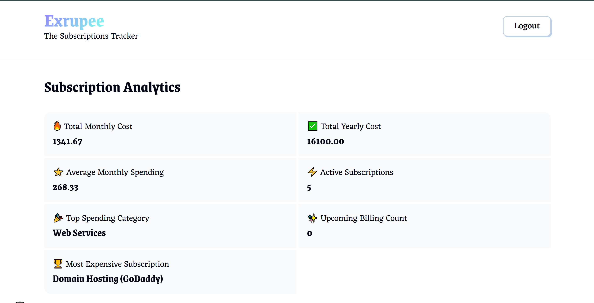
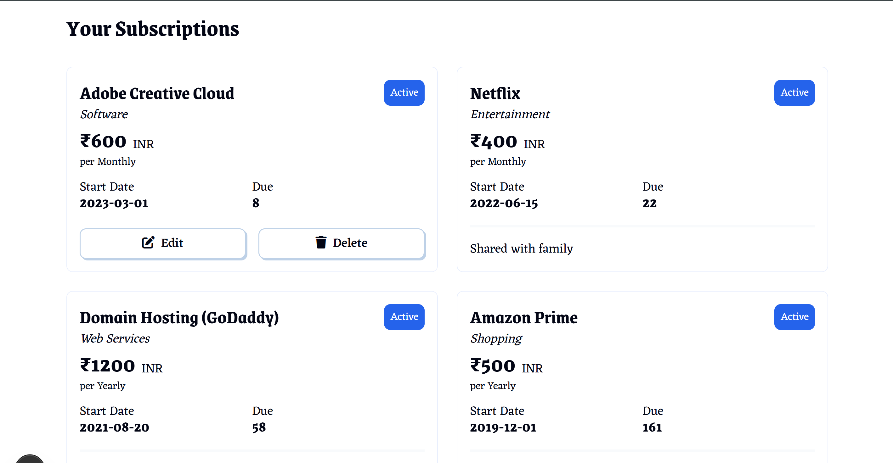

# 💸 Exrupee – Your Personal Subscription Tracker

**Exrupee** is a sleek and powerful subscription tracking platform that helps you manage all your recurring expenses in one place. Whether it's streaming services, app subscriptions, or utility bills, Exrupee keeps you informed and in control—so you're never surprised by a renewal again.

---

## 🏠 Overview

Stay on top of your subscriptions with real-time updates, automatic syncing, and a beautifully designed interface. Exrupee helps users reduce unwanted charges and gain better financial awareness.

---

## 🚀 Features

* **User Authentication**: Secure login system powered by Firebase Authentication.
* **Add & Track Subscriptions**: Log details like name, amount, renewal date, and payment method for each subscription.
* **Real-Time Data Updates**: Changes are instantly saved and reflected across sessions using Firestore Database.
* **Dashboard Overview**: View all your subscriptions in one clean, organized dashboard.
* **Responsive UI**: Built with FantaCSS and Next.js, ensuring a seamless experience across devices.
* **Reminders (Coming Soon)**: Get notified before upcoming renewals to avoid surprise charges.

---

## ⚙️ How It Works

1. **Sign Up / Log In**: Create your account with Firebase Authentication.
2. **Add Subscriptions**: Enter details for each recurring expense you want to track.
3. **Track & Manage**: Monitor total monthly/annual spend and upcoming renewals.
4. **Stay Synced**: All data is updated and stored in real-time via Firestore.

---

## 🛠️ Tech Stack

* **Frontend**: Next.js, JavaScript, FantaCSS
* **Backend**: Firebase Authentication, Firestore Database
* **Hosting**: Netlify

---

## 💡 Why Exrupee?

In today’s digital world, it’s easy to lose track of what you’re subscribed to. **Exrupee** puts you back in control—track every subscription, understand your monthly outflow, and avoid unexpected charges with an intuitive and real-time experience.

---

## 🖼️ Screenshots

### 📌 Home Page

> The home screen welcomes users with a simple interface and encourages quick login or signup to start tracking subscriptions.

---

### 📊 Dashboard & Subscriptions Page

> A real-time view of all active subscriptions, total spending, and upcoming renewal dates—all in one clean dashboard.

---

## 🔑 Getting Started

To get started:

1. Visit [Exrupee](https://shejulshubham-app-exrupee.netlify.app/)
2. Create your free account or Login with test@gmail.com and password as 'password'.
3. Add your first subscription and start managing smarter!

---

**Exrupee** – Take charge of your recurring expenses and simplify your financial life. 📅💳📊